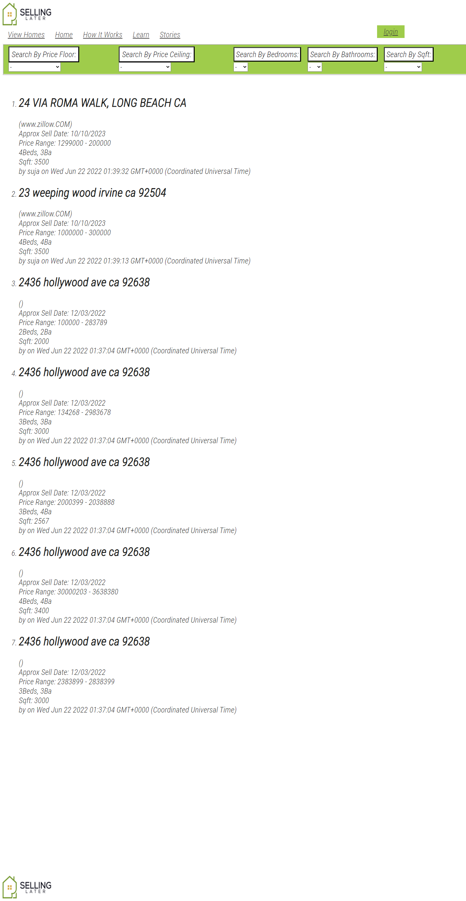

# **Selling Later**

## **Description**

A website rebuild project for 'Selling Later'; a website that functions as a message board for property owners. The website allows users to post upcoming sales that are not yet on the market (so they will not appear on any MLS databases) The primary goal of the project is to fully rebuild the website and containing databases to create a more secure, and easily accessible database of users and homes. 

## Table of Contents

- [Installation](#installation)
- [Usage](#usage)
- [License](#license)
- [Questions](#questions)

## **Installation**

No installation is required for this project. It is currently hosted on a Heroku server [here](https://tranquil-tundra-77123.herokuapp.com/)

## **Usage**

The primary functionality in it's current state is to take new users, allow them to add their homes to the databases. From the view homes tab you can view the full database of homes as well as filter by certain conditions as seen below:

## Credits

- Marissa Martinez
- Teiji Malkine
- Suja Manoj
- Erik Dell

## License

>Copyright <2022> Selling Later
>
>Though the code for this application is visible to the public, no permissions are granted for its use. This code is for private use only. Any use of the code is not allowed for anything outside of personal non-commercial work.

## Questions

Post all questions, comments and recommendations to the github repository issues.

